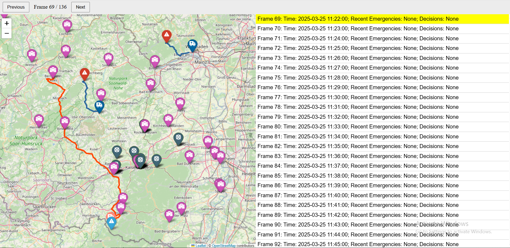
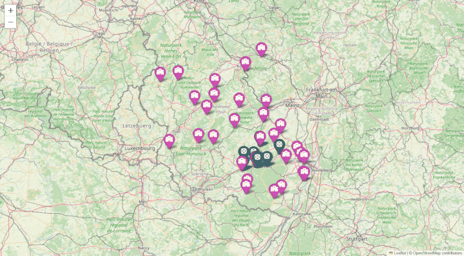
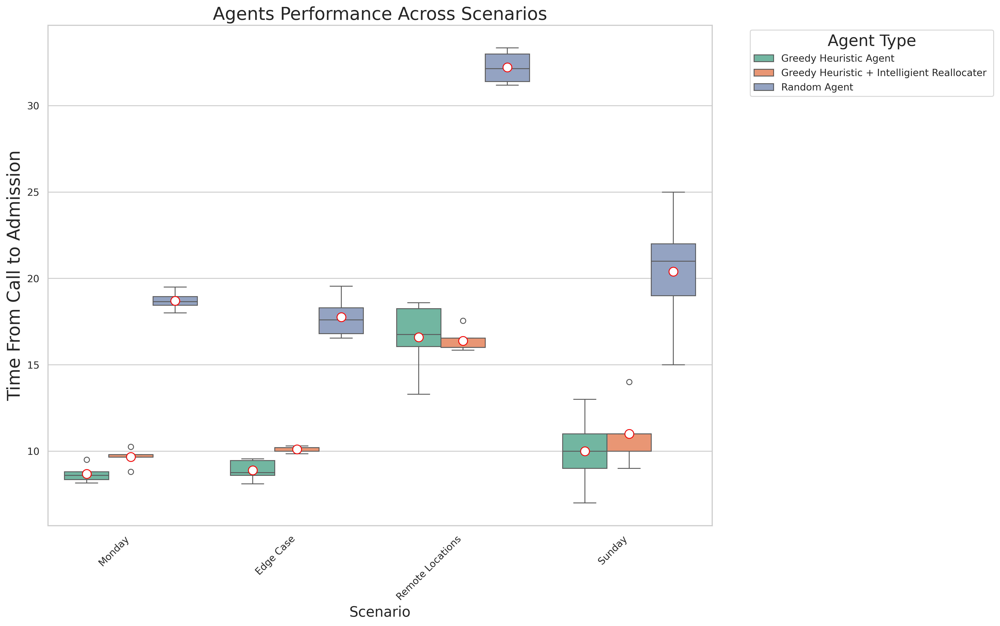

# Ambulance Game Simulator



This document explains how to set up and run the Ambulance Game Simulator, a single-player simulation in which a Python-based agent dispatches ambulances. The simulator includes ready-to-use maps for New York City and the German city of Kaiserslautern.

---
## Animated View




## Prerequisites

Make sure you have either [Miniconda](https://docs.conda.io/en/latest/miniconda.html) or [Anaconda](https://www.anaconda.com/products/distribution) installed.

---

## Installation

1. **Clone or download the repository**, then navigate to the project folder.

2. **Create and activate the conda environment** by running these commands:

```bash
conda env create -f environment.yml
conda activate AmbulanceGameEnv
```

---

## Running the Simulator

After activating the environment, you can run the simulator by executing:

```bash
python simulator.py     # performs a single simulation
python translate_log_to_visual.py   # translates the log file to a visual representation .json format
python render_all.py    # convert the .json file into a .html file
python final_visualization.py    # converts the final_results.csv file into a grouped bar chart.
```

For best results, add a Goole Maps API key to the `render.py` file. You need to run render.py for each run individually (change the input file).

---

## Custom Arguments

You can run the simulator with custom arguments:

```bash
python simulator.py \
  --map="input/map_montgomeryPa.json" \
  --scenario="input/calls_montgomeryPa_day1_full.json" \
  --agent="agents/agent_random.py" \
  --outfolder="mylogs" \
  --num-exp=3
```

Omitted arguments will use default values and `--scenario` is inferred from the `--map` filename if not provided.

Alternatively, you can use:

```bash
python simulator.py map=input/map_montgomeryPa.json agent=agents/agent_nearest.py
```

---

## Deactivating the Environment

When you finish running the simulator, deactivate the environment with:

```bash
conda deactivate
```

---

## Troubleshooting

If you experience any issues, confirm the environment was created correctly by checking:

```bash
conda env list
```

The environment `ambulance_game_env` should appear in the list. If it's missing, retry environment creation or check for errors during installation.

---
## Testing 

For testing, run:
```bash
python -m pytest
```
---

## Results
Emergency response strategies are evaluated by the average time from emergency call to hospital arrival



---
## Building Your Own Agent

After each full minute, the simulator calls the agent and provides the current state of the whole environment. The agent then returns a (potentially empty) list of decisions that it wants to make. The simulator then checks each decision to ensure it is valid (e.g., you cannot send a broken ambulance to an emergency) and applies it to the environment. After that, the environment is rolled out for another minute.

The available decisions are:

### 1. `SendAmbulanceToEmergency`
Assigns an ambulance to an emergency.
- **Format:** `("SendAmbulanceToEmergency", ambulance_id, emergency_id)`
- **Example:** `("SendAmbulanceToEmergency", 3, 17)`
- **Conditions:**
  - The emergency must have status `waiting_for_assignment`.
  - The ambulance must not be broken and must be idle or relocating.
- **Effect:**
  - The ambulance is marked as en route to the emergency.
  - The emergency status changes to `waiting_for_ambulance`.
  - The estimated arrival time is computed.

### 2. `SendAmbulanceToHospital`
Directs an ambulance to transport a patient to a hospital.
- **Format:** `("SendAmbulanceToHospital", ambulance_id, hospital_id)`
- **Example:** `("SendAmbulanceToHospital", 5, 2)`
- **Conditions:**
  - The ambulance must contain a patient.
  - The ambulance must not be broken or en route to an emergency.
- **Effect:**
  - The ambulance is assigned to the hospital and marked as `on the way to hospital`.
  - The estimated arrival time is computed.

### 3. `RelocateAmbulance`
Moves an idle ambulance to a new location.
- **Format:** `("RelocateAmbulance", ambulance_id, destination_lat, destination_lng)`
- **Example:** `("RelocateAmbulance", 7, 52.5200, 13.4050)`
- **Conditions:**
  - The ambulance must be idle or already relocating.
  - The ambulance must not be broken or en route to an emergency.
- **Effect:**
  - The ambulance is marked as relocating.
  - The estimated arrival time is computed.

### 4. `ChangeTargetHospital`
Redirects an ambulance to a new hospital if the current one is full.
- **Format:** `("ChangeTargetHospital", ambulance_id, new_hospital_id)`
- **Example:** `("ChangeTargetHospital", 8, 4)`
- **Conditions:**
  - The ambulance must be `on the way to hospital` or `at emergency`.
  - The new hospital must have available beds.
- **Effect:**
  - The ambulance is reassigned to the new hospital.
  - The estimated arrival time is recomputed.


The agent can issue any combination of the above decisions at each step, but the simulator enforces constraints to ensure logical consistency. Invalid decisions are ignored. The environment then progresses by one minute before calling the agent again.


---
## Todo

- [x] Implement random time delays for ambulances.
- [x] Fix API calls and routing (here maps, google maps, open source alternatives).
- [x] Add NYC emergency call data for multiple days.
- [x] Add a proper NYC map.
- [x] When running the simulator with a specific map, only the the correct call files should be used (based on their naming).
- [x] Add a better Results figure and better main figure (with routes)
- [x] Allow scenarios where emergencies may not require hospital transport (e.g., non-critical cases, deceased patients).
- [x] Use a (python) script that calls `renderer.py` automatically to iterate over all files in a single function call (use os.system() or what ever).
- [x] Refactor code so that hyper-parameters are properly defind in the beginning (e.g., probability of random delay for an ambulance)
- [x] Add proper command line arguments for the simulator.
- [x] Add tests: Add a `tests` folder and use pytest to test basic functionality (add more checks and more assertions and raise more errors first)
- [x] 3rd agent that combines the nearest heuristic with intelligent relocations to optimize coverage
- [x] Add more edge cases (e.g., emergency happening far away from a road)
- [x] Add a new ambulance status "being cleaned". After delivering a patient, the ambulance remains in "being cleaned" for a random time interval.
- [x] AMBULANCE_STATUS_AT_EMERGENCY should also be the state for a few minutes (randomly between 1 and 10 or so) which would be more realistic
- [ ] Add better documentation, update archive_example_output folder
- [x] check this out : https://github.com/gboeing/osmnx
- [x] Add a new result and main figure. Result figure with 3 agents and multiple scenarios. Much larger text. And more simplification (e.g., "Time From Call to Admission"). Main figure should have less clutter. and pink colour to be changed as it is not clearly visible 
- [x] Create and upload a .gif file to the readme (animated version of the left (map) part of the main figure)
- [ ] Create a (clean) public version of this repo (should not contain any history of this repo) + add your folium problem to the troubleshooting section
- [ ] for the public github: Add a link to google colab from the readme, so that people can run the simulator in Google Colab (you can install the packags and then clone this repo from within colab)
- [ ] Add a new map for all of RLP (see red cross channel for how large it should be) and generate fake call data.
- [ ] 🎉 Milestone 4 🎉
- [ ] Start writing a proper paper (e.g., _Simulation Modelling Practice and Theory_ or https://joss.theoj.org/) and start working with real RLP data.
- [ ] check this out and add refrences if found : **Gerrit - Intensity Kernels and  Mouad - STPP Inference**
