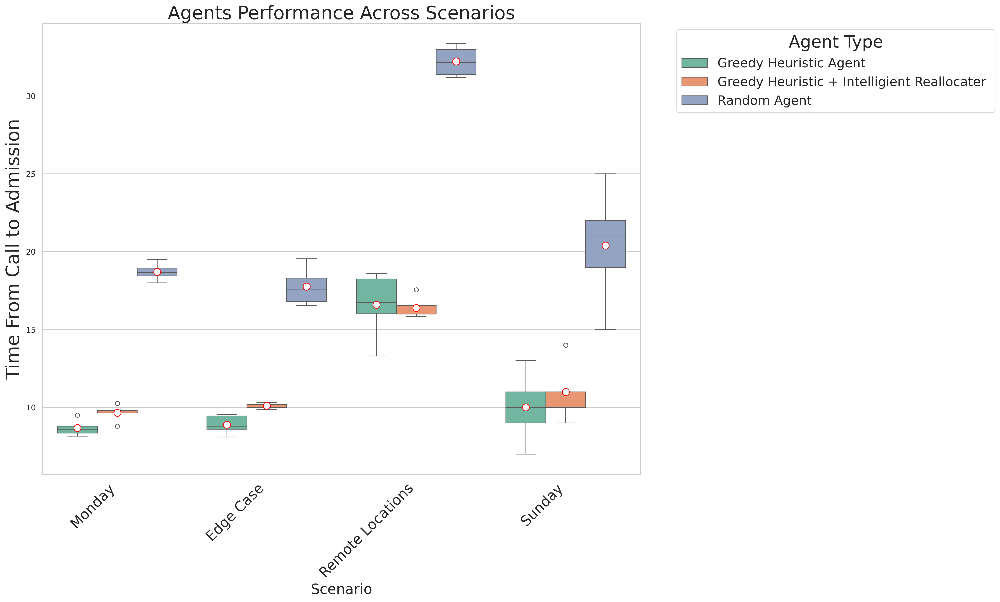

# Ambulance Game Simulator


This document explains how to set up and run the Ambulance Game Simulator, a single-player simulation in which a Python-based agent dispatches ambulances. The simulator includes ready-to-use maps for New York City and the German city of Kaiserslautern.

---
## Animated View


## Prerequisites

Make sure you have either [Miniconda](https://docs.conda.io/en/latest/miniconda.html) or [Anaconda](https://www.anaconda.com/products/distribution) installed.

---

## Installation

1. **Clone or download the repository**, then navigate to the project folder.

2. **Create and activate the conda environment** by running these commands:

```bash
conda env create -f environment.yml
conda activate AmbulanceGameEnv
```

---

## Running the Simulator

After activating the environment, you can run the simulator by executing:

```bash
python simulator.py     # performs a single simulation
python translate_log_to_visual.py   # translates the log file to a visual representation .json format
python render_all.py    # convert the .json file into a .html file
python final_visualization.py    # converts the final_results.csv file into a grouped bar chart.
```

For best results, add a Goole Maps API key to the `render.py` file. You need to run render.py for each run individually (change the input file).

---

## Custom Arguments

You can run the simulator with custom arguments:

```bash
python simulator.py \
  --map="input/map_montgomeryPa.json" \
  --scenario="input/calls_montgomeryPa_day1_full.json" \
  --agent="agents/agent_random.py" \
  --outfolder="mylogs" \
  --num-exp=3
```

Omitted arguments will use default values and `--scenario` is inferred from the `--map` filename if not provided.

Alternatively, you can use:

```bash
python simulator.py map=input/map_montgomeryPa.json agent=agents/agent_nearest.py
```

---

## Deactivating the Environment

When you finish running the simulator, deactivate the environment with:

```bash
conda deactivate
```

---

## Troubleshooting

If you experience any issues, confirm the environment was created correctly by checking:

```bash
conda env list
```

The environment `ambulance_game_env` should appear in the list. If it's missing, retry environment creation or check for errors during installation.

---
## Testing 

For testing, run:
```bash
python -m pytest
```
---

## Results
Emergency response strategies are evaluated by the average time from emergency call to hospital arrival



---
## Building Your Own Agent

After each full minute, the simulator calls the agent and provides the current state of the whole environment. The agent then returns a (potentially empty) list of decisions that it wants to make. The simulator then checks each decision to ensure it is valid (e.g., you cannot send a broken ambulance to an emergency) and applies it to the environment. After that, the environment is rolled out for another minute.

The available decisions are:

### 1. `SendAmbulanceToEmergency`
Assigns an ambulance to an emergency.
- **Format:** `("SendAmbulanceToEmergency", ambulance_id, emergency_id)`
- **Example:** `("SendAmbulanceToEmergency", 3, 17)`
- **Conditions:**
  - The emergency must have status `waiting_for_assignment`.
  - The ambulance must not be broken and must be idle or relocating.
- **Effect:**
  - Ambulance status → “on the way to emergency.”
  - Emergency status → “waiting_for_ambulance.”
  - The estimated arrival time is computed.

### 2. `SendAmbulanceToHospital`
Directs an ambulance to transport a patient to a hospital.
- **Format:** `("SendAmbulanceToHospital", ambulance_id, hospital_id)`
- **Example:** `("SendAmbulanceToHospital", 5, 2)`
- **Conditions:**
  - The ambulance must contain a patient.
  - The ambulance must not be broken or en route to an emergency.
- **Effect:**
  - The ambulance is assigned to the hospital and marked as `on the way to hospital`.
  - The estimated arrival time is computed.

### 3. `RelocateAmbulance`
Moves an idle ambulance to a new location.
- **Format:** `("RelocateAmbulance", ambulance_id, destination_lat, destination_lng)`
- **Example:** `("RelocateAmbulance", 7, 52.5200, 13.4050)`
- **Conditions:**
  - The ambulance must be idle or already relocating.
  - The ambulance must not be broken or en route to an emergency.
- **Effect:**
  - The ambulance is marked as relocating.
  - The estimated arrival time is computed.

### 4. `ChangeTargetHospital`
Redirects an ambulance to a new hospital if the current one is full.
- **Format:** `("ChangeTargetHospital", ambulance_id, new_hospital_id)`
- **Example:** `("ChangeTargetHospital", 8, 4)`
- **Conditions:**
  - The ambulance must be `on the way to hospital` or `at emergency`.
  - The new hospital must have available beds.
- **Effect:**
  - The ambulance is reassigned to the new hospital.
  - The estimated arrival time is recomputed.


The agent can issue any combination of the above decisions at each step, but the simulator enforces constraints to ensure logical consistency. Invalid decisions are ignored. The environment then progresses by one minute before calling the agent again.

---

## Additional Statuses and Notes
1. `AMBULANCE_STATUS_AT_EMERGENCY` :

After reaching the emergency, an ambulance remains on-scene for a random number of minutes (e.g. 2–10). During this period, the agent cannot send it anywhere. Once on‐scene time finishes, the agent can call SendAmbulanceToHospital (if the patient needs transport) or do nothing (if no transport is required).

2. `AMBULANCE_STATUS_BEING_CLEANED` :
   
After delivering a patient to the hospital, an ambulance transitions into “being cleaned” for a random time interval (e.g., 2–5 minutes). It cannot be sent anywhere until it becomes idle again.

3. `No Transport` :
   
In some cases, the simulation may decide that the patient doesn’t require hospital transport (either minor treatment on scene or patient deceased). The environment will mark the emergency as finished and free up the ambulance automatically.

4. `Random Delays`:
   
Each minute en route, an ambulance might experience a 1-minute delay with some probability (e.g. PROB_DELAY). That means it effectively doesn’t move that minute.


---
